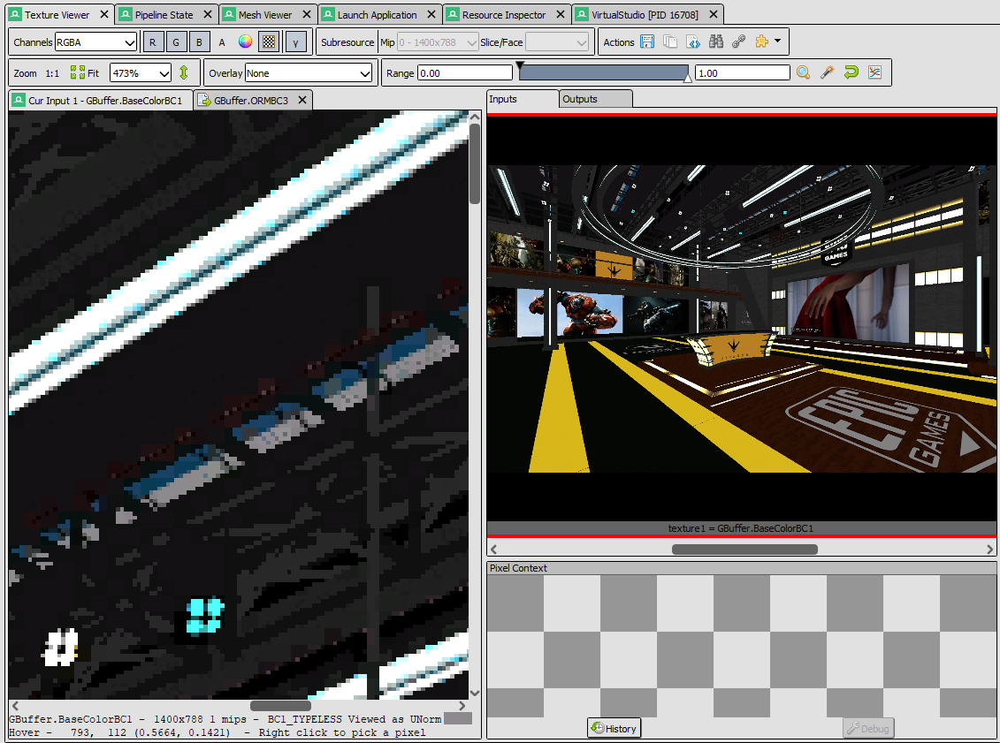
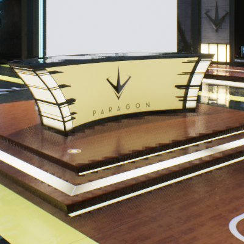
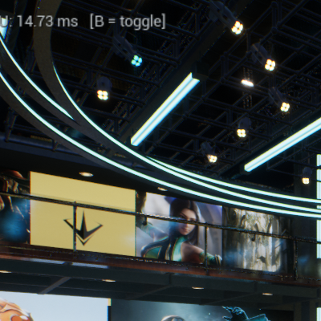
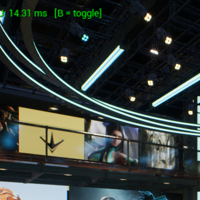
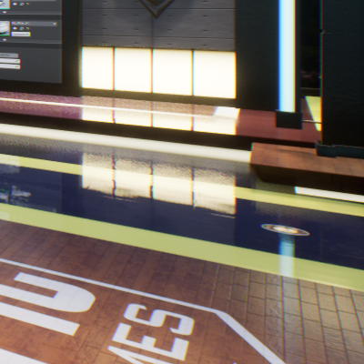
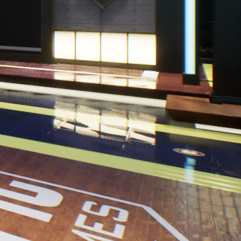

# G-Buffer BC Compression for Unreal Engine 5

A proof-of-concept UE5 plugin that BC-compresses the G-Buffer immediately after the Base Pass and substitutes the compressed textures into the Lighting Pass — reducing G-Buffer VRAM footprint by approximately **5× at 1080p, 5× at 4K**.

Verified with RenderDoc on both AMD/NVIDIA (UAV aliasing path) and Intel Iris Xe (buffer-copy path).

---

## Who this is for

This technique is a niche tool, not a general-purpose optimisation. It is irrelevant on high-end discrete GPUs where VRAM is plentiful and the memory subsystem is not the bottleneck. It is aimed at two specific hardware profiles:

- **VRAM-constrained devices** — integrated graphics (Intel Iris Xe, AMD Radeon 890M, Apple Silicon), mobile GPUs, and future XR/AR hardware where the total memory budget is small. Shrinking the G-Buffer from ~95 MB to ~20 MB at 4K frees headroom that can be filled with more scene content.
- **Memory-bandwidth-bound scenarios** — GPUs where compute throughput is high relative to memory bandwidth. If G-Buffer texture fetches are the bottleneck, reducing the data volume by 4–8× directly reduces Lighting Pass fetch time. Our testing on desktop and Surface Pro 7 did not hit this bottleneck (see below), but it is a realistic constraint on bandwidth-limited hardware.

The technique accepts a visible quality tradeoff — block compression artefacts — in exchange for these gains. It is most appropriate for developers targeting constrained hardware who are willing to trade some visual fidelity for memory headroom or bandwidth relief.

---

## Motivation

A 4K deferred scene carries three or more mandatory G-Buffer render targets (Normal, BaseColor/AO, Roughness/Metallic/Specular) at 4 bytes per pixel each. At 3840×2160 that is roughly **95 MB** of VRAM occupied every frame, read in full by the Lighting Pass and every subsequent pass that reconstructs world position or surface properties.

Driver-level lossless compression (AMD DCC, NVIDIA similar) helps for spatially coherent surfaces but provides no guarantees for complex content. GPU texture compression formats (BC1–BC7) provide **fixed compression ratios regardless of content**, at the cost of a small, bounded quality loss — the same tradeoff already accepted for asset textures in every shipped title.

This project applies that tradeoff to the G-Buffer itself.

### What this is and is not

**This is** a VRAM footprint reduction technique. The three main G-Buffer channels shrink from ~95 MB to ~20 MB at 4K.

**This is not** a guaranteed frame-time improvement. In our testing — VirtualStudio scene at 1080p through 4K on desktop (AMD/NVIDIA) and Surface Pro 7 (Intel Iris Xe) — enabling BC compression produced no measurable change in GPU frame time. The reason is structural: in deferred shading, G-Buffer texture reads and lighting computation both scale proportionally with pixel count, so the bottleneck does not shift. Frame-time gains would require a scene and resolution where G-Buffer bandwidth is the specific bottleneck — narrower than initially expected.

The honest value proposition is headroom: **the same VRAM budget fits more scene content**.

---

## Verified Results

### RenderDoc confirmation

With `r.BCGBuffer.Enable 1`, RenderDoc shows:

- A `BCGBuffer Compress` event inserted immediately after the Base Pass
- GBufferA and GBufferB replaced by **BC3_TYPELESS** textures
- GBufferC replaced by a **BC1_TYPELESS** texture
- The Lighting Pass binds these BC textures via the rebuilt `SceneTextureUniformBuffer`

Block artifacts are visible on-screen when compression is active, confirming that the Lighting Pass is reading actual BC data.



### Visual confirmation (block noise)

| BCGBuffer OFF | BCGBuffer ON |
|---|---|
|  |  |

Cropped details:

| BCGBuffer OFF | BCGBuffer ON |
|---|---|
|  |  |
|  |  |
|  |  |

### Hardware tested

| Hardware | UAV aliasing | Path used | Result |
|---|---|---|---|
| Desktop PC (UAV aliasing capable) | ✅ Yes | Direct UAV aliasing | Working, block noise visible |
| Surface Pro 7 (Intel Iris Xe) | ❌ No | Buffer-copy (uint → BC) | Working, block noise visible |

### VRAM savings (calculated from actual G-Buffer formats)

UE5 G-Buffer formats: GBufferA = `PF_A2B10G10R10` (4 B/px), GBufferB/C = `PF_B8G8R8A8` (4 B/px).
Note: with TSR active, UE5 renders at ~73% of display resolution. Values below are for full-resolution rendering.

| Resolution | GBufferA+B+C original | After BC | Saving |
|---|---|---|---|
| 1920×1080 | 23.7 MB | 4.9 MB | **18.8 MB (4.8×)** |
| 3840×2160 (4K) | 94.9 MB | 19.8 MB | **75.1 MB (4.8×)** |

The 4.8× ratio reflects the mix: GBufferC uses BC1 (8×), GBufferA and GBufferB use BC3 (4×).

---

## Technical Approach

### Compression pass placement

```
[Base Pass]  →  G-Buffer written to standard render targets
                        |
              [BC Compress Pass]  (compute shader, after Base Pass barrier)
                        |
           ┌────────────┴────────────┐
           ▼                         ▼
   BC textures (A, B, C)     Original RTs eligible
   retained as ShaderResource  for transient memory reuse
                        |
[Lighting Pass]  →  reads BC textures via SceneTextureUniformBuffer
                    (no lighting shader changes required)
```

### Per-channel format mapping

| G-Buffer | Content | BC format | Block size | Compression |
|---|---|---|---|---|
| GBufferC | BaseColor (RGB) + AO (α) | BC1 | 8 B/block | 8× vs RGBA8 — AO channel sacrificed |
| GBufferA | Normal oct-encoded + PerObjectData | BC3 | 16 B/block | 4× vs RGBA8 — all 4 channels preserved |
| GBufferB | Metallic/Specular/Roughness + ShadingModelID | BC3 | 16 B/block | 4× vs RGBA8 — ShadingModelID (α) preserved |
| Depth | — | — | — | Excluded: precision-critical; already hardware-compressed for depth test |
| Velocity | — | — | — | Excluded: sub-pixel TAA sensitivity |

### Compute encode: two hardware paths

BC formats cannot be written as render targets. Encoding always uses a compute shader dispatched at block-count resolution (one thread = one 4×4 block).

**UAV aliasing path** (`GRHISupportsUAVFormatAliasing = true`, AMD/NVIDIA):
The BC texture is created with a raw-uint aliased UAV. The compute shader writes block data directly into it with no intermediate copy.

**Buffer-copy path** (`GRHISupportsUAVFormatAliasing = false`, Intel and others):
The compute shader writes to a plain `R32G32_UINT` / `R32G32B32A32_UINT` texture at block-count dimensions. A subsequent `AddCopyTexturePass` moves the data to a BC texture via D3D12's format-compatible copy — per the D3D12 spec, `R32G32_UINT ↔ BC1/BC4` and `R32G32B32A32_UINT ↔ BC3/BC5` are valid `CopyTextureRegion` pairs because their bytes-per-block are identical.

Both paths produce the same BC texture consumed by the Lighting Pass.

### Engine integration: minimal function-pointer hook

A 13-line patch to `BasePassRendering.cpp` adds a function-pointer hook immediately after the Base Pass completes:

```cpp
// Top of BasePassRendering.cpp:
#include "SceneTextures.h"
void (*GBCGBuffer_SubstituteCallback)(FRDGBuilder&, const FSceneView&, FSceneTextures&) = nullptr;
void RegisterBCGBufferSubstituteCallback(void (*Callback)(...)) {
    GBCGBuffer_SubstituteCallback = Callback;
}

// After the Base Pass rendering loop:
if (GBCGBuffer_SubstituteCallback)
{
    const FRDGTextureRef PrevA = SceneTextures.GBufferA; // ...B, C
    for (FViewInfo& View : InViews)
        GBCGBuffer_SubstituteCallback(GraphBuilder, View, SceneTextures);
    if (/* any GBuffer pointer changed */)
        SceneTextures.UniformBuffer = CreateSceneTextureUniformBuffer(...);
}
```

The plugin registers its callback at startup. No lighting shaders, no `DeferredShadingRenderer.cpp`, no `SceneTextures.cpp` changes required. The Lighting Pass sees the updated `SceneTextureUniformBuffer` transparently.

The full patch is in `EnginePatch/BasePassRendering.patch`.

---

## Repository Structure

```
ue5_bc_gbuffer_demo.uproject
├── EnginePatch/
│   ├── BasePassRendering.patch      # Unified diff for UE 5.7 engine patch (+13 lines)
│   └── SceneTextures.patch.md       # Notes: why SceneTextures.cpp needs no changes
└── Plugins/
    └── BCGBuffer/
        ├── Shaders/Private/
        │   └── BCGBufferEncode.usf  # Compute shader, ENCODE_MODE 0–6
        │                            # (BC1/BC3/BC4/BC5 direct + round-trip decode modes)
        └── Source/BCGBuffer/Private/
            ├── BCGBufferModule.cpp          # Startup: shader dir, ViewExtension, callback
            ├── BCGBufferPass.cpp/h          # RDG pass: UAV aliasing + buffer-copy paths
            ├── BCGBufferViewExtension.cpp/h # Callback registration
            └── BCGBufferInputProcessor.h    # B key toggle + on-screen FPS/GPU HUD
```

---

## Building

This demo targets **UE 5.7 installed (binary) build**. A full engine source build is not required.

### Apply the engine patch

```
EnginePatch/BasePassRendering.patch
```

Apply to `Engine/Source/Runtime/Renderer/Private/BasePassRendering.cpp`, then recompile the Renderer module. With a binary engine, recompile the relevant `.obj` and re-link `UnrealEditor-Renderer.dll` (see patch notes for details).

### Build the plugin

```
Build.bat VirtualStudioEditor Win64 Development VirtualStudio.uproject
```

The plugin compiles as a standard UE5 plugin — no engine source modifications beyond the patch.

---

## Usage

1. Open the project in UE5 editor.
2. Press **B** to toggle BC compression. An on-screen HUD shows:
   ```
   BCGBuffer: ON   FPS: 120.0   CPU: 8.33 ms   GPU: 6.12 ms   [B = toggle]
   ```
3. Use `r.BCGBuffer.Enable 1` / `0` from the console for scripted toggling.
4. Capture with RenderDoc to inspect the `BCGBuffer Compress` pass and verify BC texture formats.

---

## Requirements

- Unreal Engine 5.5 or later (5.7 tested; binary build sufficient)
- Visual Studio 2022
- Windows 10/11, DX12
- Any DX12 GPU (UAV aliasing path for AMD/NVIDIA; buffer-copy path for Intel and others)

---

## Roadmap

### 1. BCGBuffer-native layout: per-channel format assignment

The current implementation compresses UE5's existing G-Buffer layout as-is (three RGBA8 textures). This is the root cause of the visible block noise: BC1 encodes RGB jointly, which works well for correlated colour data but breaks down when the three channels are independent — as is the case for Metallic, Specular, and Roughness packed into GBufferB.

The correct approach is to design a BCGBuffer-specific layout where each texture is matched to the BC format that suits its content:

| Data | BC format | Rationale |
|---|---|---|
| BaseColor (RGB) | BC1 | Channels are correlated — BC1 is well-suited |
| Normal (oct-encoded RG) | BC5 | Two independent channels — BC5 encodes each separately |
| Roughness | BC4 | Single channel |
| Metallic | BC4 | Single channel |
| AO | BC4 | Single channel |
| ShadingModelID | Uncompressed | Discrete integer values — BC compression destroys them |

This would eliminate the inter-channel coupling artefacts and produce output visually indistinguishable from the uncompressed G-Buffer at the same compression ratios. It requires redesigning the G-Buffer write path alongside the compression pass, which is a more invasive change than the current proof-of-concept.

### 2. GBufferC: BC1 → BC3 (AO preservation)
BC1 discards the AO alpha channel. Switching GBufferC to BC3 preserves all four channels at 16 bytes/block instead of 8. The shader permutation (`ENCODE_MODE 6`) is already implemented; only the channel descriptor in `BCGBufferPass.cpp` needs updating.

### 3. Transient memory reclaim *(core value proposition)*

BC-compressing the G-Buffer alone does not reduce peak VRAM — during the compression pass, both the original G-Buffer textures (~24 MB at 1080p) and the BC output (~5 MB) exist simultaneously. The real savings occur only when the originals are freed and their backing memory is reassigned to subsequent allocations within the same frame.

After substitution, no RDG pass references the original GBufferA/B/C. By marking them as transient (or by ensuring `ERDGTextureFlags` allow aliasing), RDG's transient allocator can reassign their ~24 MB of backing VRAM to later allocations — the Light Accumulation Buffer, reflection buffers, shadow projection buffers, or any other large transient resource allocated after the Base Pass. The result is that peak frame VRAM drops by ~19 MB at 1080p and ~75 MB at 4K.

Without this step, the technique saves bandwidth (smaller textures = less data for the Lighting Pass to fetch) but not peak VRAM. With it, the same physical memory serves double duty within a single frame.

Enable with `r.RDG.TransientAllocator 1` (off by default in editor builds) and verify with `stat RHI` → `RenderTargetMemory2D`.

### 4. Per-channel quality control
Expose per-channel CVar switches (compress / passthrough / BC7 high-quality) so developers can tune the bandwidth–quality tradeoff for their content and budget.

### 5. Depth buffer (read path only)
The depth buffer is already hardware-compressed for the depth test but is read uncompressed when sampled as a texture by SSAO, Lumen, and deferred lighting. A separate BC4 depth copy for texture reads could reduce that bandwidth. This requires more invasive Renderer changes and per-pass precision validation; it is out of scope for the current proof-of-concept.

### 6. Performance measurement methodology
Frame-time savings are content- and hardware-dependent. A focused microbenchmark — many deferred lights, complex geometry, GPU bandwidth-limited scenario — would better isolate the effect than a general scene.

### 7. Console platform support
Investigate platform-specific format reinterpret paths (GCN `HTILE` interactions, PS5 DCC) as alternatives to the compute encode pass on platforms where direct format aliasing is available.

---

## License

Plugin source code: MIT
